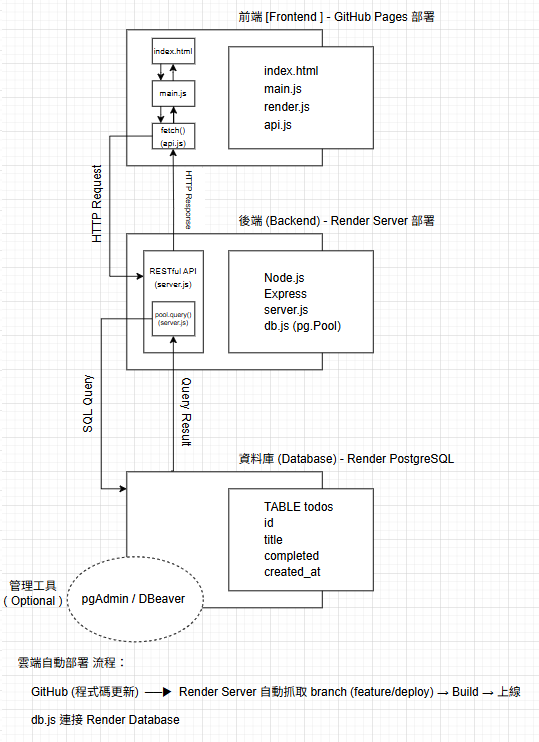

# 專案名稱 TodoList – Full Stack Practice Project

- A simple full-stack TodoList application built with Vanilla JavaScript, Node.js (Express), and PostgreSQL, fully deployed with cloud services.

## 功能簡介 Features

- Create, fetch, and delete todos
- RESTful API design
- Cloud-based backend and database
- Frontend-backend separation with API communication

## 技術棧 Tech Stack

### Frontend
- HTML / CSS
- Vanilla JavaScript (ES Modules)

### Backend
- Node.js
- Express.js

### Database
- PostgreSQL

### Tools
- Fetch API
- Git

### Deployment
- GitHub Pages (Frontend)
- Render Web Service (Backend)
- Render PostgreSQL (Database)

## 專案架構 Project Structure
```text
├─Backend/
├   ├─db.js
├   ├─server.js
├─Frontend/
├   ├─api.js
├   ├─main.js
├   ├─render.js
├─docs/
├   ├─system-architecture.png
├─.env.example
├─.gitignore
├─index.html
├─package-lock.json
├─package.json
└─README.md
```

## System Architecture & Data Flow


## API 設計 API Endpoints
```text
| Method |   Endpoint   | Description |
|--------|--------------|-------------|
|  GET   |   /todos     | Get all todos {id, title} |
|  POST  |   /todos     | Create a new todo |
| DELETE |   /todos/:id | Delete a todo |
```

## Database Schema
```sql
CREATE TABLE todos(
    id SERIAL PRIMARY KEY,
    title TEXT NOT NULL,
    completed BOOLEAN DEFAULT false,
    created_at TIMESTAMPTZ DEFAULT NOW()
)
```

## 環境設定檔 - 環境變數說明 (.env)
```text
DB_USER=your_db_user
DB_HOST=localhost
DB_NAME=todos_database
DB_PASSWORD=your_db_password
DB_PORT=5432
PORT=3000
```

## 安裝與啟動 Run Locally
1. 安裝套件
```bash
npm install
```

2. 建立 .env 檔(Create a `.env` file based on `.env.example`)
```bash
cp .env.example .env
```

3. 啟動伺服器
```bash 
node Backend/server.js
# 或 npm start
```
4. 開啟前端
```text
Open `index.html` with Live Server
```

## Deployment

### Frontend
- 已部屬到 GitHub Pages ( branch: feature/deploy )
- URL: https://zhao0521.github.io/full-stack-todolist-project/
- 訪問此 URL 即可看到前端介面

### Backend
- 已部屬到 Render (免費方案)
- URL: https://full-stack-todolist-project.onrender.com
- API Endpoint 已配置 CORS ，前端可直接 fetch
- ⚠️免費方案首次載入可能會稍慢(冷啟動延遲)

### Database
- Render PostgreSQL 雲端資料庫
- 使用內部連線於 Render 後端服務連結
- 外部連線可使用 pgAdmin 或 DBeaver 查看資料

### 使用建議
- 前端會自動呼叫 Render 後端 API
- 若要在本地運行，請依 環境設定檔(.env)設置資料庫連線

## Deployment Architecture
- Frontend deployed on GitHub Pages as a static site
- Backend deployed on Render as a Node.js web service
- PostgreSQL hosted on Render

## Deployment Notes
- Backend uses Render internal database connection for security
- SSL/TLS is required when connecting to Render PostgreSQL
- DATABASE_URL is used for production environment configuration
- Render free tier may cause cold start delays on first request

## What I Learned
- Designing RESTful APIs and managing client-server data flow
- Building a full-stack project with separated frontend and backend
- Deploying frontend and backend to cloud platforms
- Handling environment variables for different environments
- Connecting to cloud-hosted PostgreSQL with SSL/TLS
- Debugging deployment-related issues (CORS, SSL, connection strings)

## Future Improvements
- Add update (edit) todo feature
- Add completed status toggle
- User authentication

